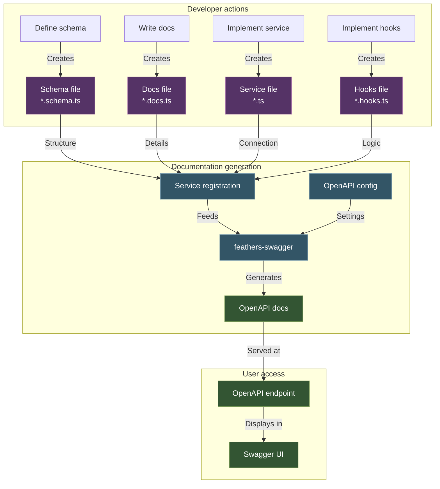

# API documentation system

This guide explains how the API documentation system works in the iR Engine codebase, including its architecture and key components.

## Overview

The iR Engine uses [feathers-swagger](https://github.com/feathersjs-ecosystem/feathers-swagger) to automatically generate OpenAPI documentation from service definitions and schema files. This creates a declarative approach where documentation is generated from code rather than maintained separately.

The system provides a foundation by automatically generating basic API structure, but developers must enhance it with custom descriptions, examples, and parameter details. **Well-documented APIs are critical for developer experience** - without these enhancements, your documentation will contain only generic placeholders that provide little practical value to API users.

### API documentation workflow



This diagram shows how components work together to generate API documentation, from developer files to the Swagger UI.

## Documentation generation process

The OpenAPI documentation in iR Engine is generated through the following process:

1. **Schema definition**: Each service has a schema file that defines its data structure and available methods
2. **Documentation enhancement**: Each service also has a documentation file that provides additional details
   - Without custom descriptions in this step, your API documentation will only contain generic placeholders
   - Replace default descriptions with meaningful, context-specific information
   - Include examples and parameter descriptions to help API consumers understand how to use your API
3. **Service registration**: When a service is registered, it includes its documentation
4. **Automatic generation**: The `feathers-swagger` package automatically generates the OpenAPI documentation based on these components
5. **Documentation serving**: The documentation is served at the `/openapi` endpoint (`localhost:3030/openapi` in your local deployment)

This process ensures that the API documentation stays in sync with the actual implementation, as it's generated directly from the code. The quality and usefulness of the documentation depend on the effort put into step 2.

## Key components

The API documentation system in iR Engine consists of several key components:

1. **Schema files** (`packages/common/src/schemas/[category]/[name].schema.ts`):
   - Define data structures, available methods, and validation rules
   - Example: `packages/common/src/schemas/cluster/build-status.schema.ts`
   - Contains path definitions, method lists, and data schemas

2. **Documentation files** (`packages/server-core/src/[category]/[name]/[name].docs.ts`):
   - Provide additional documentation details like descriptions, examples, and parameter information
   - Example: `packages/server-core/src/cluster/build-status/build-status.docs.ts`
   - Use `createSwaggerServiceOptions()` to define documentation options
   - Without proper descriptions in these files, the API documentation will only contain generic placeholders

3. **Service registration** (`packages/server-core/src/[category]/[name]/[name].ts`):
   - Connect schemas and documentation to services
   - Example: `packages/server-core/src/cluster/build-status/build-status.ts`
   - Include documentation when registering the service with `app.use()`

4. **Hooks** (`packages/server-core/src/[category]/[name]/[name].hooks.ts`):
   - Contain most of the service logic using Feathers' hook system
   - Implement before, after, and error hooks for each method
   - Allow for data validation, transformation, and business logic

5. **Validators and Resolvers**:
   - Validators ensure incoming data adheres to the schema definition
   - Resolvers allow adding or transforming data on objects going in and out of the backend
   - Provide a less verbose alternative to implementing certain functionality in hooks

6. **OpenAPI configuration** (`packages/server-core/src/createApp.ts`):
   - Set up the Swagger UI and define global OpenAPI settings
   - Configures the `/openapi` endpoint that serves the documentation

## OpenAPI configuration

The global OpenAPI configuration is set up in `packages/server-core/src/createApp.ts`. This is where you can configure the Swagger UI and define global settings for your API documentation:

```tsx
export const configureOpenAPI = () => (app: Application) => {
  app.configure(
    swagger({
      ui: swagger.swaggerUI({
        docsPath: '/openapi'
      }),
      specs: {
        info: {
          title: 'Infinite Reality Engine API Surface',
          description: 'APIs for the Infinite Reality Engine application',
          version: packagejson.version
        },
        schemes: ['https'],
        components: {
          securitySchemes: {
            BearerAuth: {
              type: 'http',
              scheme: 'bearer'
            }
          }
        },
        security: [{ BearerAuth: [] }]
      },
      idType: 'string',
      ignore: {
        paths: ['oauth', 'knex_migrations']
      }
    })
  )
  return app
}
```

For more information on configuring the OpenAPI documentation, see the [feathers-swagger documentation on swaggerOptions](https://feathersjs-ecosystem.github.io/feathers-swagger/#/api?id=swaggeroptions).

## How to document an API endpoint

To create effective API documentation, follow these steps:

1. **Create a schema file** that defines the data structure and methods
2. **Create a documentation file** with detailed descriptions, examples, and parameter information
3. **Register the service** with the documentation options
4. **Test your documentation** by viewing it in the Swagger UI at `/openapi`

For detailed instructions and examples, see the [API documentation guide](./02_documentationGuide.md).

## Additional resources

- [Feathers-swagger API documentation](https://feathersjs-ecosystem.github.io/feathers-swagger/#/api) - Complete reference for all available options
- [OpenAPI specification](https://swagger.io/specification/) - The official OpenAPI specification
- [Swagger UI](https://swagger.io/tools/swagger-ui/) - Documentation on the Swagger UI interface
- [API documentation guide](./02_documentationGuide.md) - Step-by-step guide for documenting API endpoints
